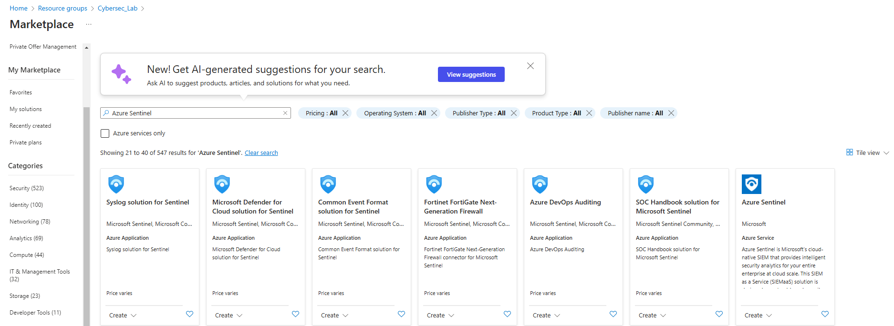
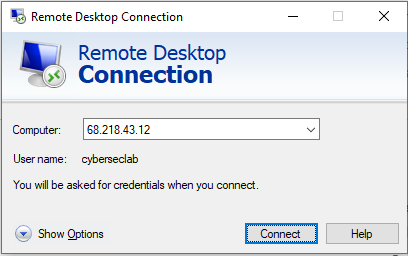

## Part 3: Deploying Microsoft Sentinel for Firewall Integration, Log Analytics, and Incident Response  
**Objective**: Set up a centralized monitoring and incident response system using Microsoft Sentinel by integrating Log Analytics workspace, integrating firewall logs, and configuring custom alerts for effective threat detection and response.  
### 3.1. Deploying Azure Sentinel  
  -   
      
    <kbd></kbd>  

    <kbd></kbd>  

    <kbd></kbd>  

    <kbd></kbd>   

### 3.2. Verifying Log Ingestion from Fortinet Firewall to Linux VM  
  -   
      
    <kbd></kbd>  

    <kbd></kbd>  

### 3.3. Configuring Data Connector  
  -   
      
    <kbd></kbd>  

    <kbd></kbd>  

    <kbd></kbd>  

    <kbd></kbd>  

    <kbd></kbd>  

    <kbd></kbd>  

    <kbd></kbd>  

    <kbd></kbd>  

### 3.4. Testing Log Query  
  -   
      
    <kbd></kbd>  
    
    <kbd></kbd>  
    
    <kbd></kbd>  

    <kbd></kbd>  

    <kbd></kbd>  
    
### 3.5. Creating Manual Alert  
  -   
      
    <kbd></kbd>  

    <kbd></kbd>  

    <kbd></kbd>  

    <kbd></kbd>  

    <kbd></kbd>  

    <kbd></kbd>  

    <kbd></kbd>  

    <kbd></kbd>  

    <kbd></kbd>  

    <kbd></kbd>  
