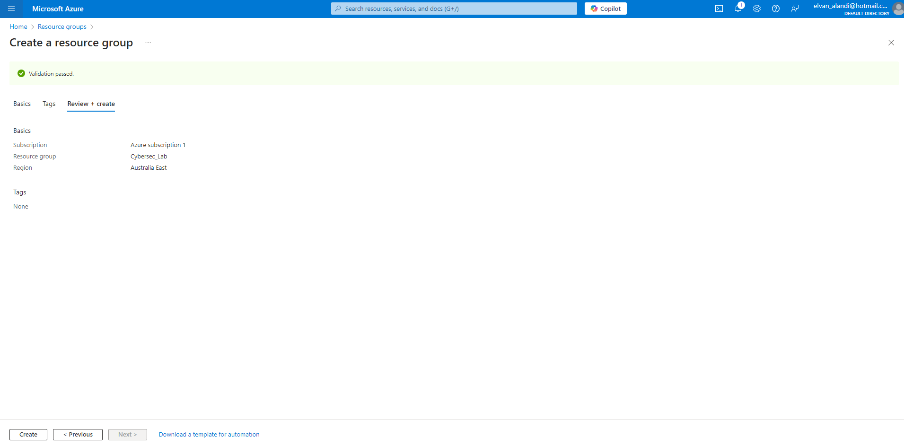

## Part 1: Creating an Azure Cloud-Based Lab Environment  
**Objective**: To access the Azure portal and become familiar with the layout and key services used in the setup.  
### 1.1. Adding a Resource Group
  - Log into the Azure portal using your account at [portal.azure.com](https://portal.azure.com). After logging in, you should see a dashboard like the image below.
      
     <kbd></kbd>
      
  - The image below shows the default subscription view upon account creation. This subscription includes $200 in credits, valid for 30 days at no cost. You can access this **Subscription** page from the dashboard by clicking on the key like symbol.
      
    <kbd></kbd>  
      
  - Next, we'll proceed with creating a resource group, which is a container for managing related Azure resources, such as virtual machines, storage accounts, virtual networks, and databases. You can access **Resource groups** from the Azure home dashboard to begin setting one up. Click on the **+ Create** icon to proceed on the next step.
      
    <kbd></kbd>  
      
  - Define the subscription, resource group name, and region for the resources. Choose a region close to your location to minimize latency.
      
    <kbd></kbd>  
      
  - Review the configuration details and click the **Create** button below to deploy.
      
    <kbd></kbd>  
      
  - As you can see, I now have a resource group created under the name **Cybersec_Lab**.
      
    <kbd></kbd>  
  
### 1.2. Adding Virtual Networks
  - Go to the **Resource Group** that we created earlier, then click on the **Create** button.
      
    <kbd></kbd>
      
  - By clicking on the **Create** button, you will be directed to the **Marketplace** page. In the **Search bar**, type in **Virtual Network** to find the resource. Select the **Virtual Network** option, and then click on the **Create** button at the bottom of the card. As shown in the image below, the second card is the Virtual Network we will be configuring.
  
    <kbd></kbd>
      
  - First, define the subscription and resource group, then provide a name for the instance and select a region that is closer to your location.
      
    <kbd></kbd>

  - Next, set up the Azure Bastion hostname and public IP address. Azure Bastion is used to manage the virtual machines, which will be deployed later. You can create the public IP address by selecting the **Create a public IP address** link under the dropdown list of the Azure Bastion public IP address settings.  
      
    <kbd></kbd>  
  
  - Going forward to the next section, we'll configure the subnets for the lab environment. The **AzureBastionSubnet** is automatically created, so we will create additional subnets for our network environment first.
  
    To begin, I created the DMZ subnet. As shown in the network diagram on the main page of this project, the DMZ network uses the CIDR block `10.10.100.0/24`. To define the address range, we'll set the starting address as `10.10.100.0/24`, which is within the `10.10.0.0/16` IPv4 address range. We won’t be configuring a NAT gateway in this setup because the FortiGate firewall will handle Network Address Translation (NAT) functionalities.  
    
    <kbd></kbd>  

  - Next, we configure the WAN subnet, as shown in the image below, using the CIDR block `10.10.1.0/24`.
       
    <kbd></kbd>  

  - Finally, I configured the Azure Bastion subnet to use the CIDR block `10.10.10.0/24`.
    
    <kbd></kbd>

  - Below is the complete list of subnets.
  
    <kbd></kbd>  

  - Review the configuration and create the virtual network.
  
    <kbd></kbd>

  - If the deployment is successful, you will see a page like this.
  
    <kbd></kbd>

### 1.3. Adding Fortigate Next-Generation Firewall  
  - Return to the **Marketplace** and search for **Fortinet FortiGate Next-Generation Firewall**.
  
    <kbd></kbd>  

  - FortiGate offers a 30-day free trial when using the pay-as-you-go pricing model, making it an ideal choice for this setup. We'll select this pricing option to take advantage of the free trial period.
  
    <kbd></kbd>  

  - Ensure that the subscription, resource group, and region are set according to your preferences. Next, configure the username, password, FortiGate name prefix, and select the **Pay As You Go** pricing model.
  
    <kbd></kbd>  

  - Now, insert the FortiGate VM's name.
  
    <kbd></kbd>  

  - This is a crucial part of the configuration, which is **Networking**. As the network diagram illustrates, the WAN network is closer to the public network, while the DMZ network connects to the internal network. Therefore, the **WAN subnet** must be placed in the **External Subnet**, while the **DMZ subnet** should be placed in the **Internal Subnet**.  
  
    We will leave the **Protected subnet** as it is, since we will not be using it in this setup. Additionally, the virtual network must be set to the new virtual network we created earlier.  
  
    Other configurations in this section are optional and can be adjusted based on personal preferences.  
  
    <kbd></kbd>  

  - For the **Public IP**, change the name to your preference using **Create new** link.
  
    <kbd></kbd>  

  - We'll skip the **Advanced** setup as we won't use the **FortiManager** and another customization.
  
    <kbd></kbd>  

  - As a final step, review your configurations and click **Create** to deploy the FortiGate VM.
  
    <kbd></kbd>
    
    <kbd></kbd>

  - To become familiar with the FortiGate interface, use the **Public IP address** of the FortiGate VM to access the FortiGate dashboard. First, navigate to the **Resource Group** and find the name of your FortiGate VM. There, you will find the Public IP address assigned to the FortiGate. Copy and paste this Public IP address into a new browser tab to access the FortiGate interface.  
  
    <kbd></kbd>

  - Login using the credentials that were set during the FortiGate VM setup.
  
    <kbd></kbd>  

  - Next, click **Begin** to proceed to the dashboard.  
    
    <kbd></kbd>

  - Click **Later** to proceed to the dashboard.
  
    <kbd></kbd>  

  - Now, we are on the Dashboard page of FortiGate. You can see all of the system information from here.
  
    <kbd></kbd>  

  - Network interfaces that pass through the firewall can be accessed under the **Network** section in the left menu by selecting **Interfaces**. Here, you’ll see **port1** and **port2** with the IP addresses of our subnets. **port1** serves as the gateway for the WAN network, while **port2** acts as the gateway to the DMZ network.  
  
    <kbd></kbd>  

  - In this lab, we will restrict administrative access on network ports, starting with the DMZ port (**port2**). For this purpose, only **SSH** and **PING** protocols will be enabled on the DMZ port to allow simulated management and testing access. However, this setup is specifically designed for simulation and does not follow best practices for a real-world environment. In a production setting, the PING protocol would typically be disabled to avoid network scanning and probing by unauthorized users, and SSH access would be highly restricted, often limited to specific IP addresses or managed through a secure VPN connection. To edit the port settings, click on the port name. An **Edit** option will appear under the row. Then, select it to proceed.  
  
    <kbd></kbd>  
  
  - For the WAN interface, we'll only allow **HTTPS** and **PING** protocols to restrict **SSH** access from the public network.
  
    <kbd></kbd>  

  - This is the configuration result for the administrative access.
  
    <kbd></kbd>  

  - Next, let's review the routing configurations that the firewall has automatically set up. These routes define connectivity for both the DMZ and WAN networks. We'll explore firewall configurations in greater detail in Part 2 of this project.  
  
    <kbd></kbd>

### 1.4. Adding Virtual Machines  
  - As illustrated in the network diagram, this setup includes two virtual machines. I am using one Windows 10 and the other Ubuntu 20.04. However, feel free to customize the operating systems based on your preferences. Let's head to the **Resource groups**.  
  
    <kbd></kbd>  

  - Navigate to the resource group you previously created, then click the **Create** button to continue.  
  
    <kbd></kbd>  

  - Once in the **Marketplace**, search for **Microsoft Windows 10**.
  
    <kbd></kbd>  

  - Click on the **Create** button, once you're on this page.  
  
    <kbd></kbd>  

  - Ensure that the subscription and resource group are correct. Then, specify the virtual machine name, select the region, and choose the virtual machine size. For this setup, I selected 2 vCPUs and 4 GiB of memory.
  
    <kbd></kbd>  

  - Next, configure the administrator account settings and select **None** for public inbound ports, as we’ll rely on the firewall to manage port access.
  
    <kbd></kbd>  

  - Then, specify the OS disk type. I’m selecting HDD as it’s cheaper. Make sure to check the **Delete with VM** option to ensure all associated data is removed when the VM is deleted. Click **Next** to continue to the next step.  
  
    <kbd></kbd>  

  - For the **Networking** section, select the **DMZ** subnet. A Public IP and Network Security Group aren’t needed here since FortiGate already handle these functions. Check the **Delete NIC when VM is deleted** option. Load balancing is also not required for this setup.  
  
    <kbd></kbd>  

  - In the **Management** section, enable **Auto-shutdown** and set a specific shutdown time to help control costs and avoid unexpected charges from running the VM longer than needed. After configuring this, proceed to the next section, **Monitoring**.  
  
    <kbd></kbd>  

  - Rename the diagnostics storage account as desired. I’ve enabled **Boot diagnostics** using a custom storage account for logging VM events.  
  
    <kbd></kbd>  

  - I skipped the **Advanced** section and went directly to the **Review** section to finalize the setup before creating the Windows 10 VM.  
  
    <kbd></kbd>  

  - The image below is the result of the VM deployment.  
  
    <kbd></kbd>  

  - We'll follow the same steps as with the Windows VM to deploy an Ubuntu VM. Start by going to the **Marketplace** and searching for **Ubuntu**.  
  
    <kbd></kbd>  

  - I am using **Ubuntu 20.04** as it is a stable version, but feel free to choose any version you prefer.  
  
    <kbd></kbd>  

  - Specify the subscription, resource group, name, region, image, and size of the virtual machine.
   
    <kbd></kbd>  

  - Provide the administrator account credentials. It is better to use an SSH public key, but in this lab, I'm using a password for simplicity. Select **None** for the public inbound ports.  
  
    <kbd></kbd>  

  -
  

  

  

  

  

  
