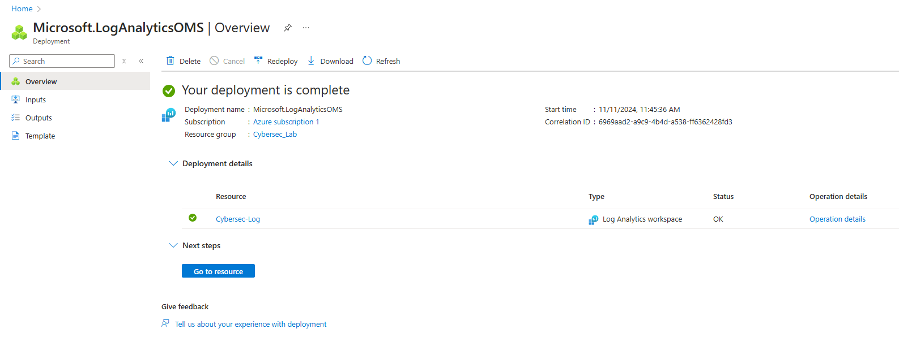
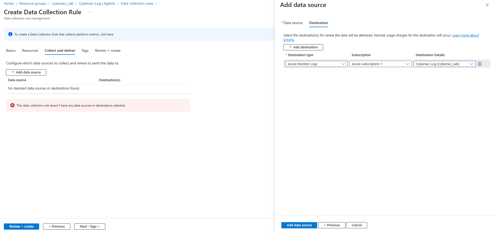
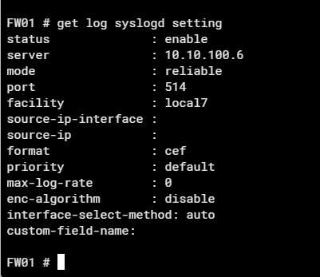

## Part 2: Configuring Routing and Advanced Fortinet Firewall Settings  
**Objective**: To implement network routing configurations within Azure, focusing on segmenting traffic between the WAN, DMZ, and internal networks. This part will enhance security by establishing controlled access points and managing traffic flow with Fortinet's NGFW.  
### 2.1. Configuring Network Routing  
  -   
      
    <kbd></kbd>  
  
    <kbd></kbd>  
    
    <kbd></kbd>  

    <kbd></kbd>  

    <kbd></kbd>  

    <kbd></kbd>  

    <kbd></kbd>  

    <kbd></kbd>  

    <kbd></kbd>  

    <kbd></kbd>  

    <kbd></kbd>  

    <kbd></kbd>  

    <kbd></kbd>

    <kbd></kbd>  

    <kbd></kbd>  

    <kbd></kbd>  

    <kbd></kbd>
    
### 2.2. Configuring Firewall Rules  
  -   
      
    <kbd></kbd>

    <kbd></kbd>

    <kbd></kbd>  

    <kbd></kbd>

    <kbd></kbd>

    <kbd></kbd>

    <kbd></kbd>

    <kbd></kbd>

    <kbd></kbd>

    <kbd></kbd>

    <kbd></kbd>

    <kbd></kbd>

    <kbd></kbd>

    <kbd></kbd>

    <kbd></kbd>

    <kbd></kbd>

    <kbd></kbd>  

### 2.3. Configuring IPS (Intrusion Prevention System) Rules  
  -   
      
    <kbd></kbd>  

    <kbd></kbd>  

    <kbd></kbd>  

    <kbd></kbd>  

    <kbd></kbd>  

    <kbd></kbd>  

    <kbd></kbd>  

    <kbd></kbd>  

### 2.4. Configuring Log Analytics with FortiGate Event Forwarding via Syslog  
  -   
      
    <kbd></kbd>

    <kbd></kbd>  

    <kbd></kbd>  

    <kbd></kbd>  

    <kbd></kbd>  

    <kbd></kbd>  

    <kbd></kbd>  

    <kbd></kbd>  

    <kbd></kbd>  

    <kbd></kbd>  

    <kbd></kbd>  

    <kbd></kbd>  

    <kbd></kbd>  

    <kbd></kbd>  

    <kbd></kbd>  

    <kbd></kbd>  

    <kbd></kbd>  

    <kbd></kbd>  

    <kbd></kbd>  

    <kbd></kbd>  

    <kbd></kbd>  

    <kbd></kbd>  

    <kbd></kbd>  

    <kbd></kbd>  

    <kbd></kbd>  
