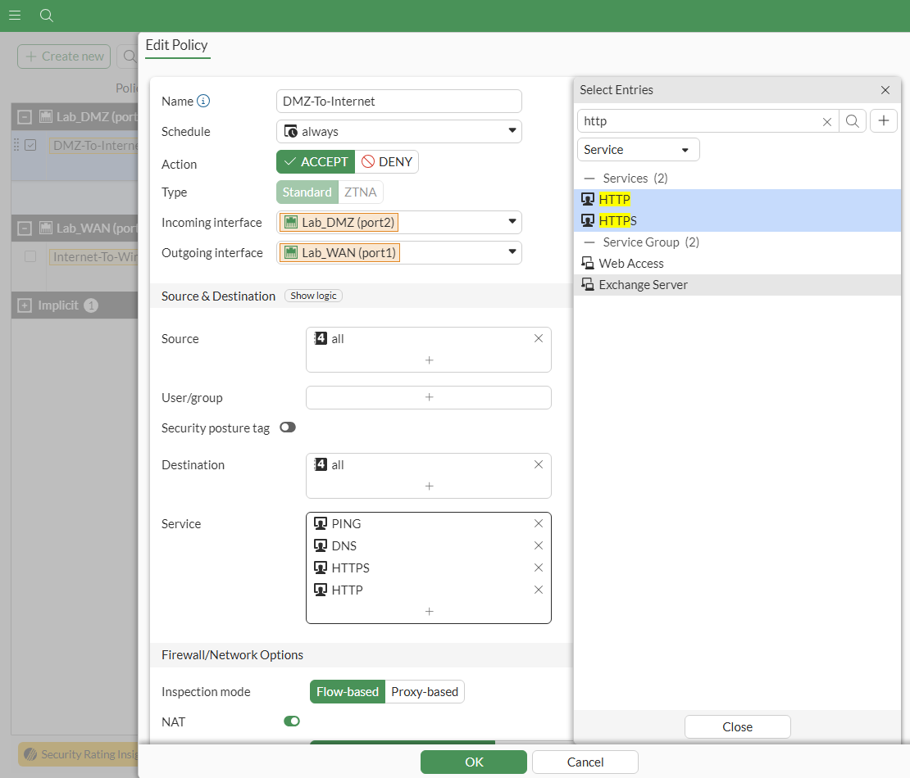

## Part 2: Configuring Routing and Advanced Fortinet Firewall Settings  
**Objective**: To implement network routing configurations within Azure, focusing on segmenting traffic between the WAN, DMZ, and internal networks. This part will enhance security by establishing controlled access points and managing traffic flow with Fortinet's NGFW.  

**Tools and Requirements**:  
- Azure Account and Subscription
- FortiGate NGFW
- Azure Virtual Machines (Windows 10 & Ubuntu)
- Azure Virtual Networks
- Basic Networking Knowledge
- SSH Client
- Azure CLI/PowerShell
- Basic knowledge of Remote Desktop (RDP)
  
### 2.1. Configuring Network Routing  
  - When configuring network routing, route tables are necessary to determine where data should be directed. To configure a route table, search for **Route tables** in the search bar at the top of the page. This will take you to the route tables page, where you can click the **Create route table** button. We'll make DMZ route table first.  
      
    <kbd></kbd>

  - Define the subscription, resource group, region, and name for the DMZ route table. Set **Propagate gateway routes** to **Yes** to automatically receive routes from a connected gateway, ensuring traffic is routed through the gateway to other networks.  
    
    <kbd></kbd>  
    
  - Review the DMZ route table and create it.  
    
    <kbd></kbd>  
    
  - Wait until your deployment is complete. After that, click the **Go to resource** button to view the DMZ route table.  
    
    <kbd></kbd>  
    
  - Here is the DMZ route table that has been created. No routes have been set up yet.  
    
    <kbd></kbd>  
    
  - To add a route, go to the **Routes** menu under the **Settings** section on the left and click **Add**. Specify the route name, and set the **Destination IP** to 0.0.0.0/0, with the **Next hop address** as the Fortigate IP (10.10.100.4) to direct traffic from the DMZ network to the internet.  
    
    <kbd></kbd>  
    
  - The new route has been set. Now, we will add the subnet to the route table.  
    
    <kbd></kbd>  
    
  - **Subnets** can also be accessed under **Settings**. Associate the subnet with the DMZ network to enable the route to direct traffic from the DMZ to the internet.  
    
    <kbd></kbd>  
    
  - The final result of the DMZ route table is shown in the image below.  
    
    <kbd></kbd>  
    
  - Using the same steps, we will now create the WAN route table.  
    
    <kbd></kbd>  
    
  - The WAN network will route traffic to the DMZ network, so the **Destionation IP** is the subnet of the DMZ network (10.10.100.0/24), and the **Next hop address** is  port 1 of the Fortinet Firewall (10.10.1.4).  
    
    <kbd></kbd>  
    
  - Here is the final result of the WAN route table.  
    
    <kbd></kbd>  
    
  - Next, test the route table to verify if it's working by performing a network test from the Windows 10 VM.  
    
    <kbd></kbd>
    
  - Connect to the Windows 10 VM using Bastion.  
    
    <kbd></kbd>  
    
  - Provide the Windows 10 VM Credentials.  
    
    <kbd></kbd>  
    
  - Open **Command Prompt** from the Windows search bar or by using Windows Run (Win + R) and type `cmd`. Then, ping the Fortinet private IP address and the Linux VM to test the connectivity.  
    
    <kbd></kbd>  
    
  - The internet may not be working, but that's okay, as we haven't configured the firewall rules yet.  
    
    <kbd></kbd>
    
### 2.2. Configuring Firewall Rules  
  - Log in to the Fortigate and go to **Firewall Policy**. Currently, there is only one rule, which is an implicit deny. To allow internet access, click the **+ Create new** button to add additional rules.  
      
    <kbd></kbd>  
    
  - Change the action to **Accept**, set the incoming interface to the DMZ port (port 2) and the outgoing interface to the WAN port (port 1). The allowed services should be **PING** and **DNS**. Set both the Source and Destination to **all**. Then, activate **NAT** since the firewall will act as a NAT device between two networks.    
    
    <kbd></kbd>  
    
  - Allow traffic for all sessions in the logging options and enable the policy to apply the changes.  
    
    <kbd></kbd>  

    <kbd></kbd>  
    
  - Test the ping again, but this time ping Google's DNS server (8.8.8.8) to verify internet connectivity.  
    
    <kbd></kbd>
    
  - In the **Forward Traffic** menu in Fortigate, the traffic should now show as successfully leaving the network, indicating that the route and firewall rules are correctly configured for internet access.  
    
    <kbd></kbd>
    
  - Think of **Virtual IP** as a form of NAT. We'll configure it to forward RDP traffic from the internet to the Windows VM.  
    
    <kbd></kbd>
    
  - Return to the **Firewall Policy** and create a new policy. Set the incoming interface to the WAN network (port 1) and the outgoing interface to the DMZ network (port 2). Set the destination to the Virtual IP that you've created and the service to **RDP**. This time, disable **NAT** because the **Virtual IP** already handles port forwarding.  
    
    <kbd></kbd>
    
  - Enable the policy and allow logging for all sessions to monitor the traffic.  
    
    <kbd></kbd>  
  
    <kbd></kbd>  
    
  - Now, configure the remote desktop settings on the Windows VM. Search for **Remote desktop settings** and ensure that **Remote Desktop** is enabled. Then, go to the **Advanced settings** to configure additional options as needed.  
    
    <kbd></kbd>
    
  - Uncheck **Require computers to use Network Level Authentication to connect** in the **Advanced settings** to allow RDP connections without the need for NLA.  
    
    <kbd></kbd>
    
  - Turn off the firewall on the Windows VM. The easiest way to access this is by searching for **Firewall & network protection** in the Windows search bar.  
    
    <kbd></kbd>
    
  - Try connecting again using **Remote Desktop Connection** from the local computer (not the VM) by entering the public IP address or the Virtual IP of the Windows VM.  
    
    <kbd></kbd>  
  
    <kbd></kbd>  
    
  - Click **Yes** when prompted with a certificate warning to proceed with the remote desktop connection.  
    
    <kbd></kbd>
    
  - We should now be able to connect to the VM from the external network using Remote Desktop.  
    
    <kbd></kbd>  

### 2.3. Configuring IPS (Intrusion Prevention System) Rules  
  - The routes have been set. Now, to block suspicious traffic, we can utilize the **IPS (Intrusion Prevention System)** feature from Fortinet NGFW (Next-Generation Firewall) to detect and block potential threats.  
      
    <kbd></kbd>  
    
  - Click **+ Create new** to create a new IPS sensor rule. Activate **Block malicious URLs** and select **Block**. Then, click on **+ Create New** in the **IPS Signatures** to define the signatures for blocking suspicious traffic.   
    
    <kbd></kbd>  
    
  - Choose the following settings for the IPS signature rule:  
    - Type: **Signature**
    - Action: **Monitor**
    - Packet logging: **Disable**
    - Status: **Enable**
    - Rate-based settings: **Default**
  
    For the signatures, select all the brute force signatures to monitor and detect any brute force attack attempts.  
    
    <kbd></kbd>  
    
  - To apply the IPS rule:  
    - Edit the **Internet to Windows** firewall policy.  
    - Scroll down to the Security Profiles section.  
    - Add the IPS rule (in my case, the rule name is cyber_lab).  
    - Activate the rule to enable it.
    - Allow log traffic for all sessions and enable the policy to start monitoring and blocking suspicious traffic according to the IPS rule.
    
    <kbd></kbd>  
  
    <kbd></kbd>  
    
  - To create a custom IPS signature with higher sensitivity for brute force attempts, follow these steps:
    - Go to the IPS Signatures menu.
    - Click + Create New to create a custom signature.
    - Copy and paste the following signature into the signature definition:
    `F-SBID( --attack_id 7170; --name "MS.RDP.Connection.Brute.Force."; --protocol TCP; --dst_port 3389; --flow from_client; --seq 1, relative; --pattern "|e0|"; --distance 5,packet; --within 1,packet; --rate 5,20; --track SRC_IP ; )`.
    - Save and apply the custom signature to your IPS policy for higher sensitivity in detecting RDP brute force attempts.  
    
    <kbd></kbd>  
    
  - Go back to the **Intrusion Prevention** section and add the custom signature. In the **Custom IPS Signature** section, select the custom signature you created (in my case, **RDP_Brute_Force**) and apply it to the relevant policy. Enable the policy to activate the custom signature for monitoring traffic.  
    
    <kbd></kbd>  
    
  - We should now be able to block brute force attacks. I tested it by repeatedly attempting to connect via RDP using incorrect credentials, and you can see the deny traffic logs, indicating that the IPS successfully blocked the brute force attempts.  
    
    <kbd></kbd>  

### 2.4. Configuring Log Analytics with FortiGate Event Forwarding via Syslog  
  - In this part, we'll integrate the **Log Analytics Workspace** with Fortigate. Start by searching for **Log Analytics Workspace** in the **Marketplace** and click **Create**.  
      
    <kbd></kbd>  
    
    <kbd></kbd>  
    
  - Set up the subscription, resource group, name, and region for the **Log Analytics Workspace** according to your preferences. Review the workspace settings before proceeding to create it.  
    
    <kbd></kbd>  

    <kbd></kbd>  
    
  - Allow the deployment to complete before proceeding to the next step.  
    
    <kbd></kbd>  
    
  - Go to the new **Log Analytics Workspace** from the **Resource group**.  
    
    <kbd></kbd>  
    
  - Once in the **Overview** of the workspace, navigate to the **Agents** menu under the **Settings** section on the left.  
    
    <kbd></kbd>  
    
  - Follow the instructions to download the agent onto the Linux VM. Under **Download and onboard agent for Linux**, ensure the **Linux servers** is selected, then copy the provided command.  
    
    <kbd></kbd>  
    
  - Connect to the Ubuntu VM via **Bastion**, entering the required credentials. Once connected to the VM, set it aside temporarily, and proceed to the **Fortinet firewall** configuration.  
    
    <kbd></kbd>  

    <kbd></kbd>  

    <kbd></kbd>  
    
  - In **Firewall Policy**, edit the **DMZ to Internet** policy. Add **HTTP** and **HTTPS** services to allow downloading files from the internet using `wget`.  
    
    <kbd></kbd>  

    <kbd></kbd>  
    
  - Return to the Ubuntu VM and paste the command you previously copied to initiate the download and setup of the Linux agent.  
    
    <kbd></kbd>  
    
  - After that, Return to the **Agents** section and create a **Data Collection Rules** by clicking on the **Data Collection Rules** button. This will allow the agent you set up to start collecting data.  
    
    <kbd></kbd>  
    
  - Click on the **Create** button.  
    
    <kbd></kbd>  
    
  - Specify the **Name, Subscription, Resource Group and Region** for the Data Collection Rule. For the **Platform Type**, select **Linux**.  
    
    <kbd></kbd>  
    
  - Next, click on **Add resources** and select your Linux VM from the available options.  
    
    <kbd></kbd>  
    
  - In the next section, select all the **Linux Syslog** log options under **Data source**.  
    
    <kbd></kbd>  
    
  - Specify the **Destination type**, **Subscription**, and the **Log Analytics Workspace** that you created earlier as the **Destination Details**.  
    
    <kbd></kbd>  
    
  - Review the settings for the **Data Collection Rule** and click **Create** to finalize the setup.  
    
    <kbd></kbd>  
    
  - The agent is now successfully connected to the **Log Analytics Workspace**.  
    
    <kbd></kbd>  
    
  - To ingest the syslog data into **Azure Sentinel**, go to the **Log Settings** in **Fortigate**. Then, navigate to the CLI menu on the top left side.  
    
    <kbd></kbd>  
    
  - Use the following commands in the CLI to configure syslog on the Fortigate:  
    `config log syslogd setting`  
    `set status enable`  
    `set server 10.10.100.6 # Replace with your Linux VM IP.`  
    `set format cef`  
    `set mode reliable`  
    `end`  
    
    <kbd></kbd>  
    
  - To validate the settings, use the following command in the CLI: `get log syslogd setting`.  
    
    <kbd></kbd>

    We'll proceed with deploying **Microsoft Sentinel** in [Part 3](../Azure-Sentinel/README.md).
