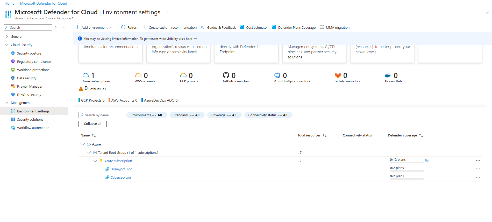
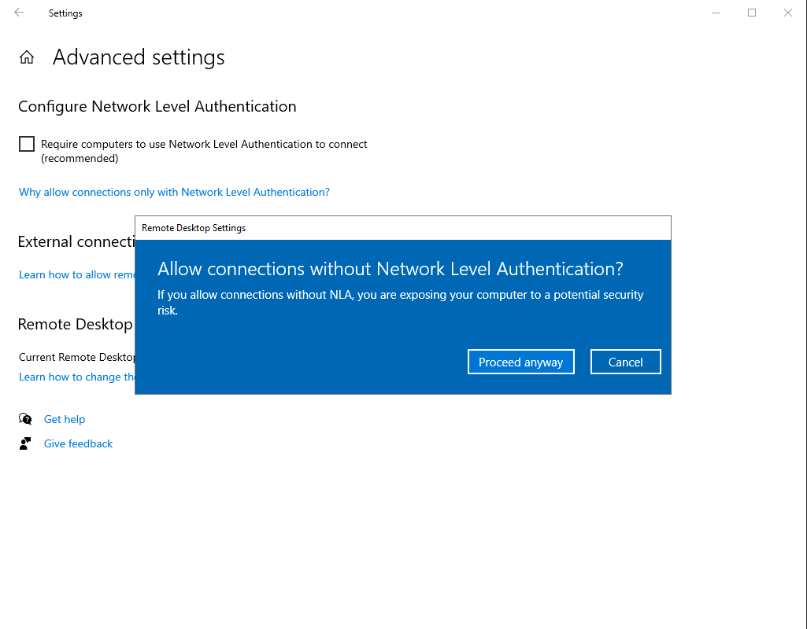

## Honeypot Deployment and Threat Visualization with Azure Sentinel  
**Objective**: Deploy honeypots as decoys, integrate Log Analytics Workspaces, and Azure Sentinel to analyze Windows Security Event Logs using KQL, and visualize attack data in World Map Workbooks.  
  
**Tools and Requirements**:  
- [Azure Account and Subscription](https://azure.microsoft.com/en-us/free/) (Free $200 Credit for 30 days)
- Microsoft Sentinel
- [Custom Powershell Script](https://github.com/joshmadakor1/Sentinel-Lab/blob/main/Custom_Security_Log_Exporter.ps1)  
- Remote Desktop Protocol (RDP)
- [IP Geo Location API](https://ipgeolocation.io/)
- Kusto Query Language (KQL)
  
### 1. Create a Honeypot Virtual Machine  
  - Go to the Microsoft Azure Dashboard, search for "virtual machines", and then click **Create** > **Azure virtual machine**.
  - Specify your subscription and Resource Group (I used the Resource Group from my Azure Cybersecurity Lab project).
  - Name your VM.
  - Select the region closest to your location (I am using Australia East as it is closest to my location).
  - Select "No infrastructure redundancy required" for the availability options.
  - Select Windows 10 Pro as the Image, and choose the newest version.
  - Choose the Size based on your preference, and ensure the VM architecture is x64.
      
    <kbd></kbd>  

  - Leave the **Disks** section as is and proceed to the **Networking** section. I created a new virtual network with subnet 10.0.0.0/24. The **Virtual Network** can be created by clicking the **Create new** button under the Virtual Network selection. Next, go to the network security group settings, select **Advanced** and then choose **Create new**. Before proceeding to the network security group settings, don't forget to check the box for **Delete public IP and NIC when VM is deleted** to ensure everything is wiped when the VM is deleted.  
  
    <kbd></kbd>  

  - In the **Network security group** settings, remove all inbound rules and add a new one with the following settings:
    - Destination port ranges: *
    - Protocol: Any
    - Action: Allow
    - Priority: 100 (low)
    - Name: Based on your preference  
  
    <kbd></kbd>  

  - Next, in the **Management** section, I enabled the **Auto-shutdown** feature to save costs. You can skip this step if you prefer.  
  
    <kbd></kbd>  

  - In **Monitoring** section, I enabled the boot diagnostics feature to monitor the VM. You can skip this step if you don't wish to monitor the VM. When finished, click the **Review + create** button.  
  
    <kbd></kbd>  
  
### 2. Create a Log Analytics Workspace  
  - Now, for the **Log Analytics Workspace**, search for it in the search bar at the top and select **Create Log Analytics Workspace**. Specify the resource group, create a name, and select the same region as the VM. Click **Review + create** to finish the configuration.  
      
    <kbd></kbd>  

### 3. Configure Microsoft Defender for Cloud  
  - Next, activate **Microsoft Defender for Cloud** to collect the Windows security events. First, search for **Microsoft Defender for Cloud**, scroll down to **Environment settings**, select the subscription, and then go to the Log Analytics workspace that has been deployed (Honeypot-Log).  
      
    <kbd></kbd>  
  
  - In the **Settings | Defender plans**, turn on **Foundational CSPM** (Cloud Security Posture Management).  
  
    <kbd></kbd>  

  - For **Settings | Data collection**, select **All Events** and then click the **Save** button.  
  
    <kbd></kbd>  

### 4. Connect Log Analytics Workspace to Virtual Machine  
  - Now, connect the Log Analytics Workspace to the Virtual Machine to enable analytics. Search for **Log Analytics Workspaces**, select the workspace, then go to **Virtual machines** > select the virtual machine's name, and click **Connect**.  
      
    <kbd></kbd>  

    <kbd></kbd>  

### 5. Configure Microsoft Sentinel  
  - Search for **Microsoft Sentinel** > click **Create Microsoft Sentinel** > select the Log Analytics workspace and click **Add**.
    > Microsoft Sentinel will now be able to collect the log data.  
      
    <kbd></kbd>  
    
### 6. Disable the Firewall in Virtual Machine  
  -   
      
    <kbd></kbd>  
  
    <kbd></kbd>  
  
    <kbd></kbd>  
  
    <kbd></kbd>  
    
### 7. Adding the Security Log Exporter Script  
  -   
      
    <kbd></kbd>  
  
    <kbd></kbd>  
  
### 8. Create a Custom Log in Log Analytics Workspace  
  -   
      
    <kbd></kbd>  
  
    <kbd></kbd>  

    <kbd></kbd>  

    <kbd></kbd>  

    <kbd></kbd>  

    <kbd></kbd>  
    
### 9. Visualize Attack in Map using Workbooks  
  -   
      
    <kbd></kbd>  
  
    <kbd></kbd>  

    <kbd></kbd>  

    <kbd></kbd>  

    <kbd></kbd>  

    <kbd></kbd>  

    <kbd></kbd>  

    <kbd></kbd>  

    <kbd></kbd>  

    <kbd></kbd>  

    <kbd></kbd>  

    <kbd></kbd>  
