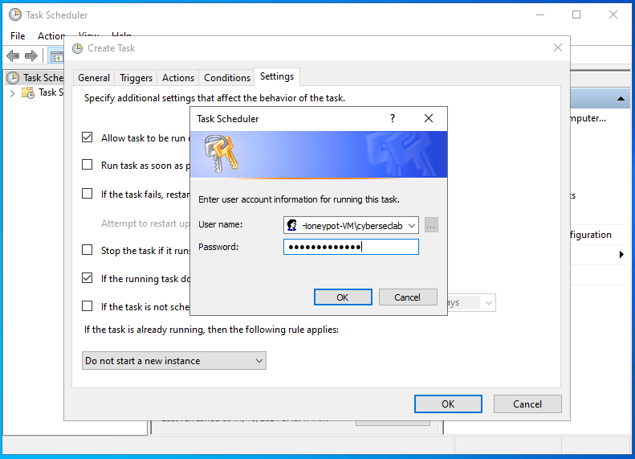

## Honeypot Deployment and Threat Visualization with Azure Sentinel  
**Objective**: Deploy honeypots as decoys, integrate Log Analytics Workspaces, and Azure Sentinel to analyze Windows Security Event Logs using KQL, and visualize attack data in World Map Workbooks.  
  
**Tools and Requirements**:  
- [Azure Account and Subscription](https://azure.microsoft.com/en-us/free/) (Free $200 Credit for 30 days)
- Microsoft Sentinel
- [Custom Powershell Script](https://github.com/joshmadakor1/Sentinel-Lab/blob/main/Custom_Security_Log_Exporter.ps1)  
- Remote Desktop Protocol (RDP)
- [IP Geo Location API](https://ipgeolocation.io/)
- Kusto Query Language (KQL)
  
### 1. Create a Honeypot Virtual Machine  
  - Go to the Microsoft Azure Dashboard, search for "virtual machines", and then click **Create** > **Azure virtual machine**.  
      
    <kbd></kbd>  

    <kbd></kbd>  

    <kbd></kbd>  

    <kbd></kbd>  

    <kbd></kbd>  
  
### 2. Create a Log Analytics Workspace  
  -   
      
    <kbd></kbd>  

### 3. Configure Microsoft Defender for Cloud  
  -   
      
    <kbd></kbd>  
  
    <kbd></kbd>  
      
    <kbd></kbd>  

### 4. Connect Log Analytics Workspace to Virtual Machine  
  -   
      
    <kbd></kbd>  

    <kbd></kbd>  

### 5. Configure Microsoft Sentinel  
  -   
      
    <kbd></kbd>  
    
### 6. Disable the Firewall in Virtual Machine  
  -   
      
    <kbd></kbd>  
  
    <kbd></kbd>  
  
    <kbd></kbd>  
  
    <kbd></kbd>  
    
### 7. Adding the Security Log Exporter Script  
  -   
      
    <kbd></kbd>  
  
    <kbd></kbd>  
  
### 8. Create a Custom Log in Log Analytics Workspace  
  -   
      
    <kbd></kbd>  
  
    <kbd></kbd>  

    <kbd></kbd>  

    <kbd></kbd>  

    <kbd></kbd>  

    <kbd></kbd>  
    
### 9. Visualize Attack in Map using Workbooks  
  -   
      
    <kbd></kbd>  
  
    <kbd></kbd>  

    <kbd></kbd>  

    <kbd></kbd>  

    <kbd></kbd>  

    <kbd></kbd>  

    <kbd></kbd>  

    <kbd></kbd>  

    <kbd></kbd>  

    <kbd></kbd>  

    <kbd></kbd>  

    <kbd></kbd>  
