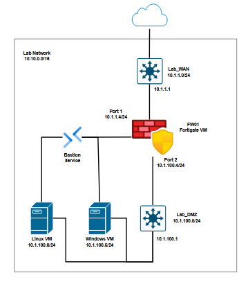

# Cloud-based Cybersecurity Lab using Microsoft Azure, Fortinet NGFW, and Microsoft Sentinel

## Project Overview
This project demonstrates a complete setup of a security lab using **Microsoft Azure**, **Fortinet FortiGate**, and **Microsoft Sentinel**. The lab includes virtual networks, firewall configurations, virtual machines, and a SIEM solution for threat monitoring and incident response.

This project is divided in three parts:
1. [Setting Up Microsoft Azure Lab Environment](./Azure/README.md)
2. [Configuring Fortinet Next-Generation Firewall](./Fortinet-Firewall/README.md)
3. [Azure Sentinel](./Azure-Sentinel/README.md)

Below is the network diagram used for this lab setup.  
  
