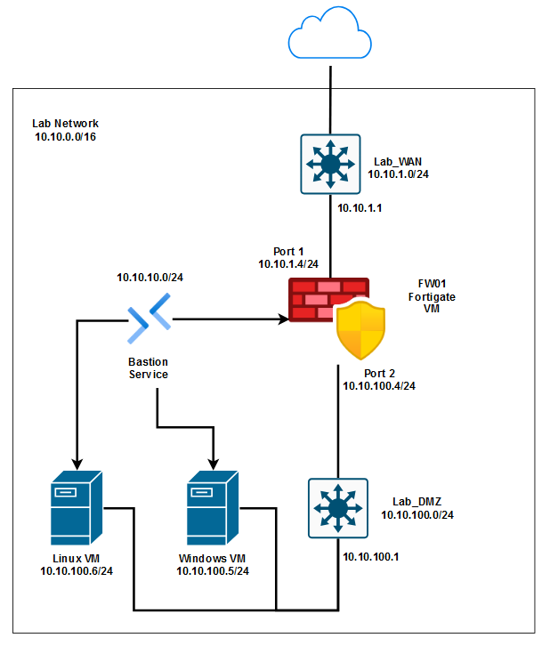

# Cloud-based Cybersecurity Lab using Microsoft Azure, Fortinet NGFW, and Azure Sentinel

## Project Overview
This project demonstrates a complete setup of a security lab using **Microsoft Azure**, **Fortinet FortiGate**, and **Azure Sentinel**. It includes virtual networks, firewall configurations, virtual machines, a honeypot, and a SIEM solution for threat monitoring and incident response.  

### Azure Cybersecurity Lab Key Components:
1. [Setting Up Microsoft Azure Lab Environment](./Azure/README.md)  
   - Familiarize with the Azure portal and services.
   - Set up resources: Resource Groups, Virtual Networks, FortiGate Firewall, and Virtual Machines.
   - Establish secure connectivity using Azure Bastion.
2. [Configuring Fortinet Next-Generation Firewall](./Fortinet-Firewall/README.md)  
   - Implement routing to segregate traffic across WAN, DMZ, and internal networks.
   - Configure FortiGate NGFW policies, IPS rules, and custom signatures to secure traffic.
   - Integrate FortiGate logs with Azure Log Analytics for monitoring and threat detection.
3. [Azure Sentinel](./Azure-Sentinel/README.md)   
   - Set up Microsoft Sentinel in a Log Analytics workspace.
   - Configure FortiGate connector in Sentinel for log collection.
   - Create custom alerts for events (e.g., brute force attacks) and generate incidents for response.
  
Below is the network diagram used for the key components above:  
  

### [Honeypot Deployment and Threat Visualization with Azure Sentinel](./Honeypot/README.md)  
  - Set up virtual machines as decoys, integrate Log Analytics Workspaces, and deploy Azure Sentinel.
  - Use KQL (Kusto Query Language) for log querying and analyze Windows Security Event Logs.
  - Visualize attack data in World Map Workbooks within Azure Sentinel.
